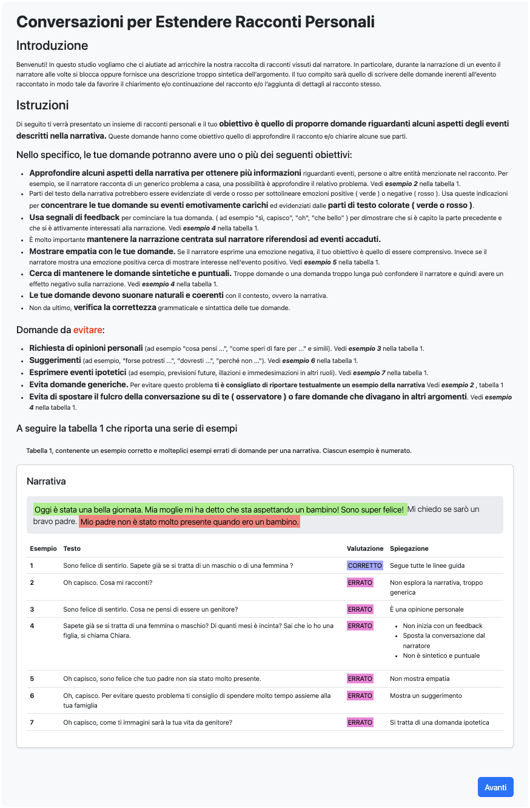
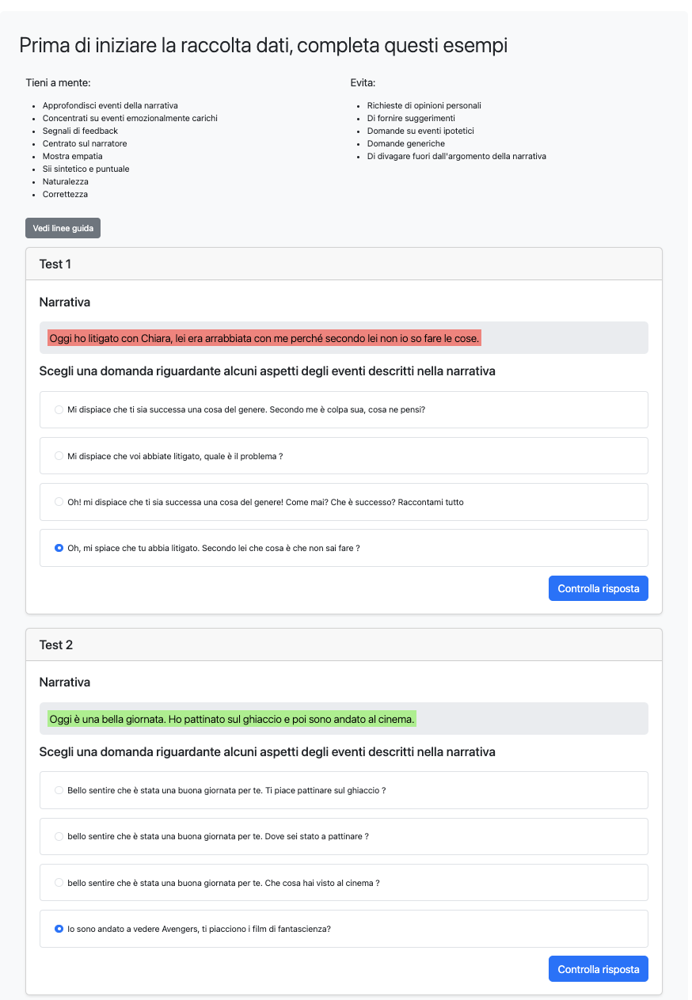
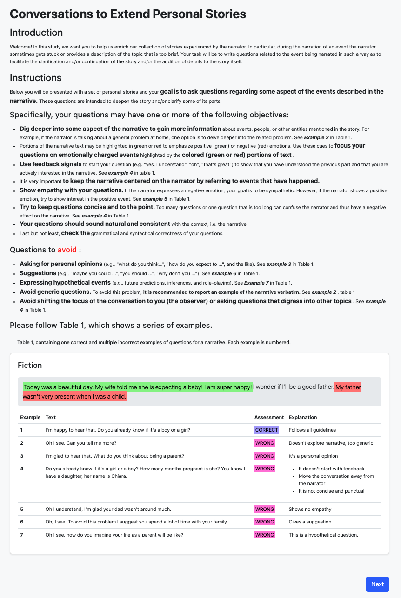
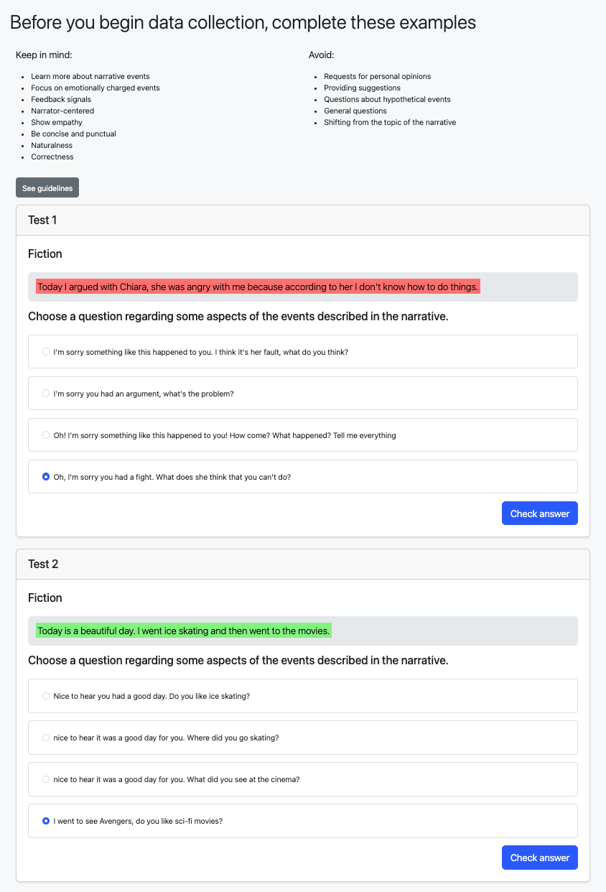

# Can LLMs Help Recollect and Elaborate On Our Personal Experiences? 

The screenshots of the web interface and guidelines can be found below. The code of the UI is located in the folder.

## Guidelines & Interface

The figure depicts the guidelines we gave to the annotators for collecting the ANTE dataset.

  

This is an example of the qualifying test to both train and skim the annotators. 

  

This is the form used by the annotators to write the eliciting response. On top, we gave a brief reminder of the guidelines. Moreover, the annotators could go back to the initial guidelines.

  

English version of the guidelines we gave to the annotators for collecting the ANTE dataset.

  

English version of the qualifying test to both train and skim the annotators. 

  

English version of the form used by the annotators to write the eliciting response. On top, we gave a brief reminder of the guidelines. Moreover, the annotators had the possibility to go back to the initial guidelines.

  

